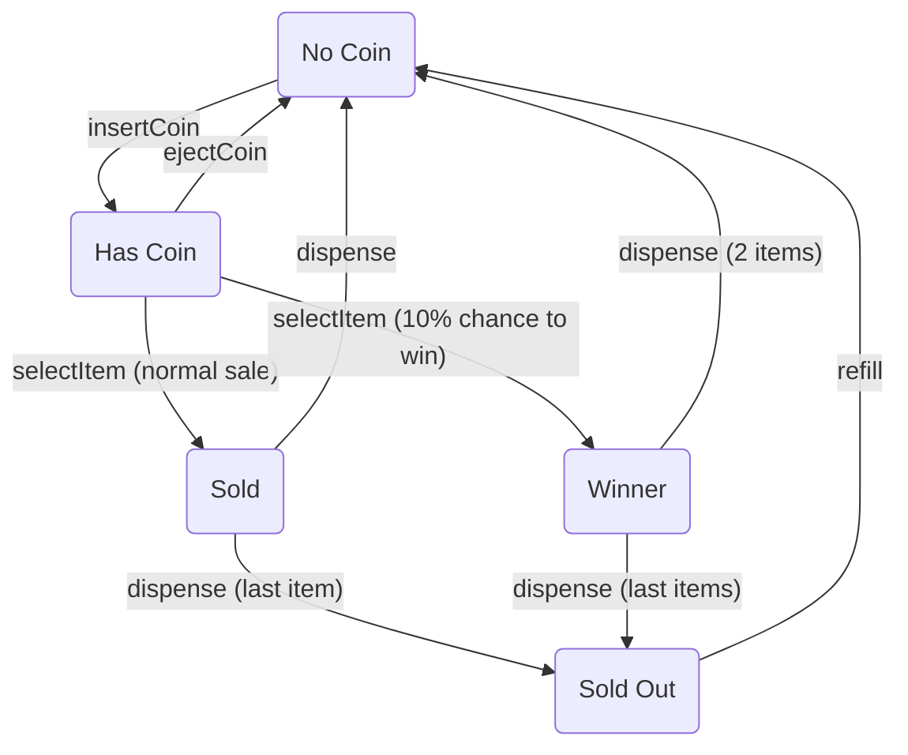

# Smart Vending Machine: State Design Pattern Implementation

[](https://www.java.com)
[](https://spring.io/projects/spring-boot)
[](https://refactoring.guru/design-patterns/state)
[](https://www.docker.com/)

This project provides a classic example of the **State Design Pattern** by modeling a smart vending machine. The
machine's behavior (e.g., accepting coins, dispensing items) changes based on its current state, and this logic is
encapsulated cleanly within separate state objects.

## Key Features & Architecture

- **Stateless State Objects:** State classes are thread-safe, reusable Singletons managed by Spring.
- **Decoupled Domain Model:** The `VendingMachine` entity is decoupled from framework logic using an `@EntityListener`.
- **Rich Domain Model:** The `VendingMachine` entity orchestrates its own lifecycle, delegating actions to its current
  state object. It also correctly models internal actions (like `dispense`) that are triggered automatically after a
  user action (`selectItem`).
- **Dockerized Environment:** Includes a `docker-compose.yml` for a one-command Oracle XE database setup.

## State Transition Diagram



## How to Run

### Prerequisites

- Java 21+, Maven 3.6+, Docker, and Docker Compose

### Step 1: Start the Database

From the project root, start the Oracle database container.
*(Note: It may take a minute for the database to fully initialize on first launch.)*

```bash
docker-compose up -d
```

### Step 2: Run the Application

Once the database is running, start the Spring Boot application:
```bash
mvn spring-boot:run
```
The API will be available at `http://localhost:8080`.

## API Usage Demonstration

Let's walk through a typical interaction with the vending machine using `cURL`.

### 1. Create a New Machine

First, create a machine with ID `VM-01` in "Lobby" with 5 items.
```bash
curl -X POST http://localhost:8080/api/machines -H "Content-Type: application/json" -d \
'{"machineId": "VM-01", "location": "Lobby", "initialStock": 5}' | jq
```
The response will show `itemCount: 5` and `stateName: "NO_COIN"`.

### 2. Insert a Coin

```bash
curl -i -X POST http://localhost:8080/api/machines/VM-01/coin
```
Now, check the status. The state has changed to `HAS_COIN`.
```bash
curl http://localhost:8080/api/machines/VM-01 | jq
# "stateName": "HAS_COIN"
```

### 3. Try an Invalid Action

What if we try to insert another coin?
```bash
curl -i -X POST http://localhost:8080/api/machines/VM-01/coin
# HTTP/1.1 400 Bad Request
# {"error":"You can't insert a coin now."}
```
The state pattern correctly prevents this.

### 4. Select an Item

Now, let's select an item. This triggers both a state change and the internal `dispense` action.
```bash
curl -i -X POST http://localhost:8080/api/machines/VM-01/select
```
Check the status again. The machine has dispensed one item and returned to the `NO_COIN` state.
```bash
curl http://localhost:8080/api/machines/VM-01 | jq
# "itemCount": 4,
# "stateName": "NO_COIN"
```
*(If you were lucky, you might have entered the `WINNER` state and the item count would be 3!)*

### 5. Deplete the Stock

Repeat the process of inserting a coin and selecting an item 4 more times. On the last selection:
```bash
# After the 5th item is dispensed...
curl http://localhost:8080/api/machines/VM-01 | jq
# "itemCount": 0,
# "stateName": "SOLD_OUT"
```

### 6. Try to Use a Sold-Out Machine

If we try to insert a coin now, it will fail.
```bash
curl -i -X POST http://localhost:8080/api/machines/VM-01/coin
# HTTP/1.1 400 Bad Request
# {"error":"You can't insert a coin now."} - Correct! The machine is sold out.
```

### 7. Refill the Machine

Let's refill the machine. This action will also reset its state.
```bash
curl -i -X POST "http://localhost:8080/api/machines/VM-01/refill?count=10"
```
Check the status one last time.
```bash
curl http://localhost:8080/api/machines/VM-01 | jq
# "itemCount": 10,
# "stateName": "NO_COIN"
```
The machine is ready for business again!

### Shutting Down

To stop and remove the database container, run:
```bash
docker-compose down
```

## License

This project is licensed under the MIT License. See the `LICENSE` file for details.