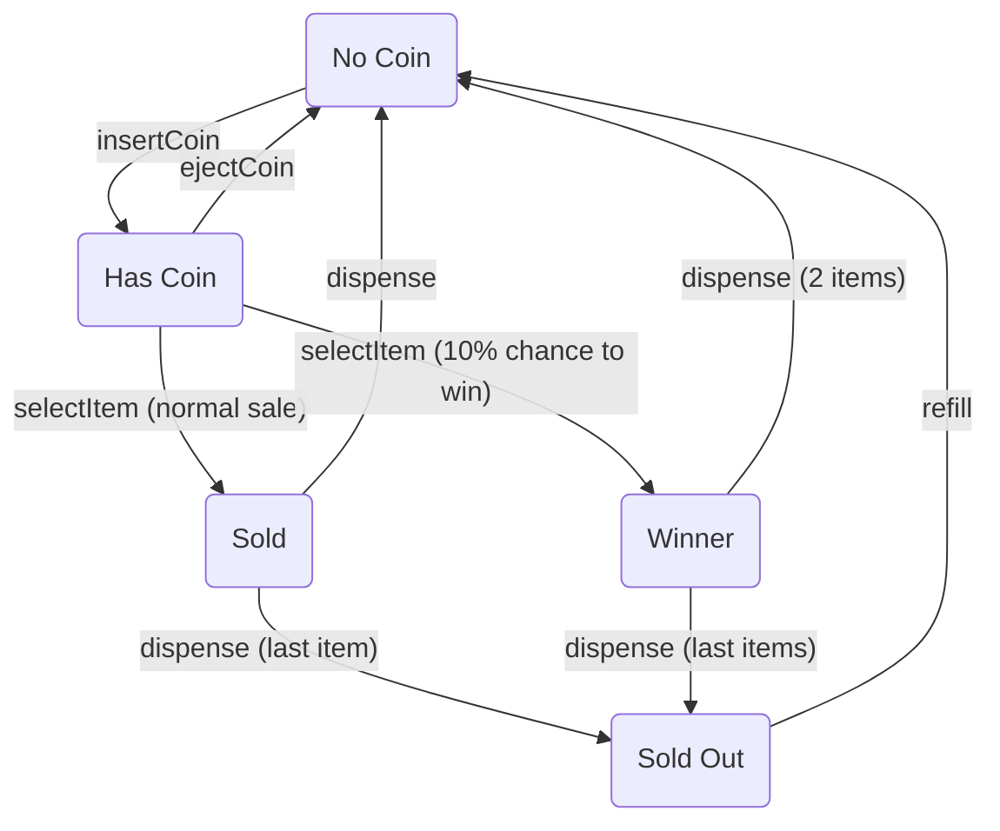

# Smart Vending Machine: State Design Pattern Implementation

[](https://www.java.com)
[](https://spring.io/projects/spring-boot)
[](https://refactoring.guru/design-patterns/state)
[](https://www.docker.com/)

This project is a practical and robust implementation of the **State Design Pattern**. It models the behavior of a smart
vending machine, where actions are either permitted or denied based on the machine's current state. The core principle
is to encapsulate all state-specific logic into separate, clean, and maintainable objects, eliminating complex
conditional logic from the main business class.

## Key Features & Architecture

- **Stateless State Objects:** State classes are implemented as thread-safe, reusable Singletons managed by Spring,
  ensuring robustness in a concurrent environment.
- **Decoupled Domain Model:** The `VendingMachine` entity is a "clean" domain object, decoupled from Spring's
  infrastructure. State injection is handled by a separate `@EntityListener`, adhering to better architectural
  practices.
- **Rich Domain Model:** The `VendingMachine` entity is not just a data container. It orchestrates its own lifecycle by
  delegating actions to its current state object. It also correctly models internal actions (like `dispense`) that are
  automatically triggered after a user action (`selectItem`).
- **Centralized Exception Handling:** A global `@ControllerAdvice` intercepts custom exceptions (
  `InvalidActionException`) to provide consistent, meaningful HTTP `400 Bad Request` error responses to the client.
- **Dockerized Environment:** The project includes a `docker-compose.yml` file for a one-command Oracle XE database
  setup, making the local development environment incredibly easy to spin up.

## State Transition Diagram

This diagram visualizes the complete lifecycle of the vending machine.



## How to Run

### Prerequisites

- Java 21+
- Maven 3.6+
- Docker and Docker Compose

### Step 1: Start the Database

From the project root directory, start the Oracle database container. This command will download the necessary image and
run it in the background.
*(Note: It may take a minute for the database to fully initialize on its first launch.)*

```bash
docker-compose up -d
```

### Step 2: Run the Application

Once the database is running, you can start the Spring Boot application using the Maven wrapper:

```bash
./mvnw spring-boot:run
```

The API will be available at `http://localhost:8080`.

---

## API & Workflow Demonstration (Exhaustive Tests)

This section provides a complete, step-by-step guide to test every possible action in every state. This demonstrates the
robustness of the state machine and its error-handling capabilities.

### 1. Initial Setup: Create the Machine

First, create a machine with ID `VM-01` and an initial stock of 2 items. This small stock size makes it easier to test
the `SOLD_OUT` state later.

```bash
curl -X POST http://localhost:8080/api/machines -H "Content-Type: application/json" -d \
'{"machineId": "VM-01", "location": "Lobby", "initialStock": 2}' | jq
```

### 2. State-by-State Behavior Analysis

Let's test each state systematically.

---

### ➤ State: `NO_COIN`

**Description:** The machine is idle, has stock, and is waiting for a coin.

**Setup:** This is the default state for a new, stocked machine.

```bash
# To verify, check the status:
curl http://localhost:8080/api/machines/VM-01 | jq
# Expected: "stateName": "NO_COIN", "itemCount": 2
```

#### ✅ Valid Actions

- **`insertCoin`**:
  ```bash
  curl -i -X POST http://localhost:8080/api/machines/VM-01/coin
  # Expected: HTTP 200 OK. The machine transitions to the HAS_COIN state.
  ```

#### ❌ Invalid Actions (Rejected with HTTP 400)

- **`ejectCoin`:** There's no coin to eject.
  ```bash
  curl -i -X DELETE http://localhost:8080/api/machines/VM-01/coin
  # Expected: HTTP 400 Bad Request
  # Response: {"error":"Action 'ejectCoin' is not allowed when machine is in 'NO_COIN' state."}
  ```
- **`selectItem`:** You must insert a coin first.
  ```bash
  curl -i -X POST http://localhost:8080/api/machines/VM-01/select
  # Expected: HTTP 400 Bad Request
  # Response: {"error":"Action 'selectItem' is not allowed when machine is in 'NO_COIN' state."}
  ```

---

### ➤ State: `HAS_COIN`

**Description:** A coin has been inserted. The user can select an item or get their coin back.

**Setup:** Insert a coin while in the `NO_COIN` state.

```bash
# Setup: Make sure machine is in NO_COIN state, then run:
curl -X POST http://localhost:8080/api/machines/VM-01/coin
# Verify:
curl http://localhost:8080/api/machines/VM-01 | jq
# Expected: "stateName": "HAS_COIN"
```

#### ✅ Valid Actions

- **`ejectCoin`:** Returns the coin and moves back to `NO_COIN`.
  ```bash
  curl -i -X DELETE http://localhost:8080/api/machines/VM-01/coin
  # Expected: HTTP 200 OK.
  ```
- **`selectItem`:** Dispenses item(s) and automatically moves to the next appropriate state (`NO_COIN` or `SOLD_OUT`).
  ```bash
  curl -i -X POST http://localhost:8080/api/machines/VM-01/select
  # Expected: HTTP 200 OK.
  ```

#### ❌ Invalid Actions (Rejected with HTTP 400)

- **`insertCoin`:** You cannot insert more than one coin.
  ```bash
  # With a coin already inside...
  curl -i -X POST http://localhost:8080/api/machines/VM-01/coin
  # Expected: HTTP 400 Bad Request
  # Response: {"error":"Action 'insertCoin' is not allowed when machine is in 'HAS_COIN' state."}
  ```

---

### ➤ States: `SOLD` & `WINNER` (Internal/Transient States)

**Description:** These are not user-facing states. The machine enters them for a fraction of a second *immediately*
after `selectItem` is called and *before* it settles back into its next stable state. Their purpose is to handle the
internal logic of dispensing one or more items. You cannot directly test them with an API call, but you can observe
their effects.

**Demonstration:**

```bash
# 1. Setup: Get into HAS_COIN state with 2 items.
# (If not already there, create a new machine or refill and insert a coin).

# 2. Select an item.
curl -X POST http://localhost:8080/api/machines/VM-01/select

# 3. Observe the result.
curl http://localhost:8080/api/machines/VM-01 | jq
# Expected (Normal Sale): "itemCount": 1, "stateName": "NO_COIN"
# Expected (Winner Sale): "itemCount": 0, "stateName": "SOLD_OUT"
```

---

### ➤ State: `SOLD_OUT`

**Description:** The machine is empty. No more items can be sold. It can only be refilled.

**Setup:** Buy all the items from the machine.

```bash
# 1. Create a machine with 1 item.
curl -X POST http://localhost:8080/api/machines -H "Content-Type: application/json" -d '{"machineId":"VM-02", "location":"Test", "initialStock":1}'
# 2. Insert coin.
curl -X POST http://localhost:8080/api/machines/VM-02/coin
# 3. Select item.
curl -X POST http://localhost:8080/api/machines/VM-02/select
# 4. To verify, check the status:
curl http://localhost:8080/api/machines/VM-02 | jq
# Expected: "itemCount": 0, "stateName": "SOLD_OUT"
```

#### ✅ Valid Actions

- **`refill`:** This is the only way to make the machine operational again.
  ```bash
  curl -i -X POST "http://localhost:8080/api/machines/VM-02/refill?count=10"
  # Expected: HTTP 200 OK. State returns to NO_COIN.
  ```

#### ❌ Invalid Actions (Rejected with HTTP 400)

- **`insertCoin`:** Machine is out of stock.
  ```bash
  curl -i -X POST http://localhost:8080/api/machines/VM-02/coin
  # Expected: HTTP 400 Bad Request
  # Response: {"error":"Action 'insertCoin' is not allowed when machine is in 'SOLD_OUT' state."}
  ```
- **`selectItem`:** Machine is out of stock.
  ```bash
  curl -i -X POST http://localhost:8080/api/machines/VM-02/select
  # Expected: HTTP 400 Bad Request
  # Response: {"error":"Action 'selectItem' is not allowed when machine is in 'SOLD_OUT' state."}
  ```

### Shutting Down

To stop and remove the database container and its associated volume, run:

```bash
docker-compose down -v
```

## License

This project is licensed under the MIT License. See the `LICENSE` file for details.