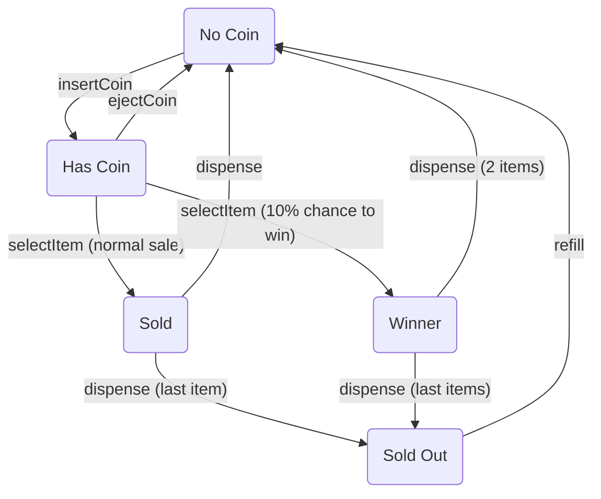

# Smart Vending Machine: State Design Pattern Implementation

[](https://www.java.com)
[](https://spring.io/projects/spring-boot)
[](https://refactoring.guru/design-patterns/state)
[](https://www.docker.com/)

This project provides a classic example of the **State Design Pattern** by modeling a smart vending machine. The
machine's behavior (e.g., accepting coins, dispensing items) changes based on its current state, and this logic is
encapsulated cleanly within separate state objects.

## Key Features & Architecture

- **Stateless State Objects:** State classes are thread-safe, reusable Singletons managed by Spring.
- **Decoupled Domain Model:** The `VendingMachine` entity is decoupled from framework logic using an `@EntityListener`.
- **Rich Domain Model:** The `VendingMachine` entity orchestrates its own lifecycle, delegating actions to its current
  state object. It also correctly models internal actions (like `dispense`) that are triggered automatically after a
  user action (`selectItem`).
- **Dockerized Environment:** Includes a `docker-compose.yml` for a one-command Oracle XE database setup.

## State Transition Diagram



## How to Run

### Prerequisites

- Java 21+, Maven 3.6+, Docker, and Docker Compose

### Step 1: Start the Database

From the project root, start the Oracle database container.
```bash
docker-compose up -d
```

### Step 2: Run the Application

Once the database is running, start the Spring Boot application:
```bash
mvn spring-boot:run
```
The API will be available at `http://localhost:8080`.

---

## API & Workflow Demonstration (Exhaustive Tests)

This section provides a complete, step-by-step guide to test every possible action in every state.

### 1. Initial Setup: Create the Machine

First, create a machine with ID `VM-01` and an initial stock of 2 items. This small stock size makes it easier to test
the `SOLD_OUT` state.

```bash
curl -X POST http://localhost:8080/api/machines -H "Content-Type: application/json" -d \
'{"machineId": "VM-01", "location": "Lobby", "initialStock": 2}' | jq
```

### 2. State-by-State Behavior Analysis

Let's test each state systematically.

---

### ➤ State: `NO_COIN`

**Description:** The machine is idle, has stock, and is waiting for a coin.

**Setup:** The machine starts in this state. You can also get here after a successful purchase or by ejecting a coin.

```bash
# To verify, check the status:
curl http://localhost:8080/api/machines/VM-01 | jq
# Expected: "stateName": "NO_COIN", "itemCount": 2
```

#### ✅ Valid Actions

- **Insert a Coin:**
  ```bash
  curl -i -X POST http://localhost:8080/api/machines/VM-01/coin
  # Expected: HTTP 200 OK. State transitions to HAS_COIN.
  ```

#### ❌ Invalid Actions

- **Eject a Coin:**
  ```bash
  curl -i -X DELETE http://localhost:8080/api/machines/VM-01/coin
  # Expected: HTTP 400 Bad Request
  # Response: {"error":"You can't eject a coin now."}
  ```
- **Select an Item:**
  ```bash
  curl -i -X POST http://localhost:8080/api/machines/VM-01/select
  # Expected: HTTP 400 Bad Request
  # Response: {"error":"You can't select an item now."}
  ```

---

### ➤ State: `HAS_COIN`

**Description:** A coin has been inserted. The machine is waiting for item selection or coin ejection.

**Setup:** Insert a coin while in the `NO_COIN` state.
```bash
# Ensure you are in NO_COIN state, then:
curl -X POST http://localhost:8080/api/machines/VM-01/coin
# To verify, check the status:
curl http://localhost:8080/api/machines/VM-01 | jq
# Expected: "stateName": "HAS_COIN", "itemCount": 2
```

#### ✅ Valid Actions

- **Eject Coin:**
  ```bash
  curl -i -X DELETE http://localhost:8080/api/machines/VM-01/coin
  # Expected: HTTP 200 OK. State returns to NO_COIN.
  ```
- **Select Item:**
  ```bash
  curl -i -X POST http://localhost:8080/api/machines/VM-01/select
  # Expected: HTTP 200 OK.
  # An item is dispensed, itemCount decreases by 1 (or 2 if you win!).
  # State automatically transitions through SOLD/WINNER and ends up in NO_COIN.
  ```

#### ❌ Invalid Actions

- **Insert another Coin:**
  ```bash
  curl -i -X POST http://localhost:8080/api/machines/VM-01/coin
  # Expected: HTTP 400 Bad Request
  # Response: {"error":"You can't insert a coin now."}
  ```

---

### ➤ States: `SOLD` & `WINNER` (Internal/Transient)

**Description:** These are not user-facing states. The machine enters them for a fraction of a second *immediately*
after `selectItem` is called and *before* it settles back into `NO_COIN` or `SOLD_OUT`. Their purpose is to handle the
internal logic of dispensing one or more items. You cannot directly test them with an API call, but you can observe
their effects.

**Demonstration:**

```bash
# 1. Setup: Get into HAS_COIN state with 2 items.
# (If not already there, create a new machine or refill and insert a coin).

# 2. Select an item.
curl -X POST http://localhost:8080/api/machines/VM-01/select

# 3. Observe the result.
curl http://localhost:8080/api/machines/VM-01 | jq
# Expected (Normal Sale): "itemCount": 1, "stateName": "NO_COIN"
# Expected (Winner Sale): "itemCount": 0, "stateName": "SOLD_OUT"
```

---

### ➤ State: `SOLD_OUT`

**Description:** The machine is empty. No more items can be sold.

**Setup:** Buy all the items from the machine.
```bash
# 1. Create a machine with 1 item.
curl -X POST http://localhost:8080/api/machines -H "Content-Type: application/json" -d '{"machineId":"VM-02", "location":"Test", "initialStock":1}'
# 2. Insert coin.
curl -X POST http://localhost:8080/api/machines/VM-02/coin
# 3. Select item.
curl -X POST http://localhost:8080/api/machines/VM-02/select
# 4. To verify, check the status:
curl http://localhost:8080/api/machines/VM-02 | jq
# Expected: "itemCount": 0, "stateName": "SOLD_OUT"
```

#### ✅ Valid Actions

- **Refill the Machine:**
  ```bash
  curl -i -X POST "http://localhost:8080/api/machines/VM-02/refill?count=10"
  # Expected: HTTP 200 OK. State returns to NO_COIN, and itemCount is updated.
  ```

#### ❌ Invalid Actions

- **Insert a Coin:**
  ```bash
  curl -i -X POST http://localhost:8080/api/machines/VM-02/coin
  # Expected: HTTP 400 Bad Request
  # Response: {"error":"You can't insert a coin now."}
  ```
- **Select an Item:**
  ```bash
  curl -i -X POST http://localhost:8080/api/machines/VM-02/select
  # Expected: HTTP 400 Bad Request
  # Response: {"error":"You can't select an item now."}
  ```

### Shutting Down

To stop and remove the database container, run:
```bash
docker-compose down
```